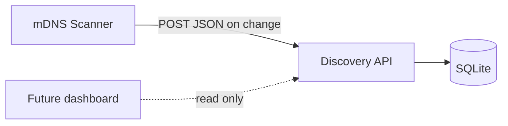

# LAN Discovery Tool

[](https://github.com/JakeyLaww/lan_discovery_tool/actions/workflows/build-and-test.yml)
[](https://github.com/JakeyLaww/lan_discovery_tool/actions/workflows/codeql-analysis.yml)

Discover **mDNS-advertising** hosts and services on your home LAN, persist observations to SQLite, maintain an **approved device registry**, and raise alerts for unknown devices and baseline mismatches (hostname/service changes on approved devices). 

This is a home-lab visibility tool, not a full network audit. It only sees devices that announce via mDNS while the scanner is running.

## Components

| Component | Role | Location |
|-----------|------|----------|
| **mDNS Scanner** | Multicast browse, follow-up probes, stdout logging; POSTs changes to the API when configured | `build/scanner` |
| **Discovery API** | Ingest discovery events, serve device list (FastAPI) | [`api/`](api/) |
| **SQLite database** | Devices, services, and an append-only audit log | `api/data/lan.db` (local) or Docker volume |

The scanner never opens the database directly. Only the Discovery API reads and writes SQLite.

## Build

From the repository root:

```bash
./scripts/build.sh           # incremental configure, build, and ctest
./scripts/build.sh --clean   # wipe build/ and full rebuild
./scripts/build.sh --reset-db  # delete api/data/lan.db (fresh DB on next API start)
```

Output: `build/scanner`

## Run locally

### Full stack (scanner + Discovery API)

**Terminal 1: Discovery API:**

```bash
cd api && python3 -m venv .venv && source .venv/bin/activate
pip install -r requirements.txt
uvicorn app.main:app --host 127.0.0.1 --port 8000
```

See [`api/README.md`](api/README.md) for API environment variables and endpoints.

**Terminal 2: mDNS Scanner with persistence:**

```bash
./build/scanner --api-url http://127.0.0.1:8000
```

Use `-d` only for troubleshooting (verbose mDNS diagnostics). For approve/alerts workflow see [`api/README.md`](api/README.md#manual-test-two-terminals).

Discovery lines still print to stdout. Only **new or changed** records are POSTed to the API. The scanner may include `mac` in POST JSON when ARP resolves the source IP.

### Scanner only

```bash
./build/scanner
```

Console output only (no persistance)

### Scanner options

| Flag | Effect |
|------|--------|
| (default) | Log level INFO |
| `-d`, `--debug` | DEBUG diagnostics (broadcasts, ignored queries) |
| `-q`, `--quiet` | WARN and ERROR only |
| `-v`, `--verbose` | Wire-level hex dumps (use with `-d`) |
| `-I`, `-i`, `--interface <name>` | Bind multicast to one NIC (e.g. `eth0`) |
| `--max-probes-per-tick <n>` | Follow-up mDNS probes per poll tick (default 8) |
| `--probe-cooldown-ms <ms>` | Min ms before re-probing the same name (default 60000) |
| `--api-url <base>` | POST discovery changes to Discovery API |
| `--api-token <key>` | Optional `X-API-Key` header |
| `-h`, `--help` | Usage |

On startup the scanner logs **local IPv4 interfaces** for diagnostics.

### Configuration (scanner ↔ API)

| Env / flag | Purpose |
|------------|---------|
| `LAN_API_URL` / `--api-url <base>` | API base URL (CLI wins); posts to `/v1/discovery/events` |
| `LAN_API_TOKEN` / `--api-token` | Shared secret for `X-API-Key` when the API has `LAN_API_TOKEN` set |

### Database utilities

Inspect or reset the local SQLite file (includes the audit log, which is not exposed via GET endpoints):

```bash
python3 scripts/lan_db.py dump
python3 scripts/lan_db.py reset   # stop uvicorn first if the file is locked
```

Honors `LAN_DB_PATH` when set (same as the Discovery API).

## Run with Docker

From the repository root:

```bash
./scripts/compose_up.sh
./scripts/compose_up.sh --reset-db   # stop stack, remove SQLite volume, rebuild
```

- Discovery API: http://127.0.0.1:8000
- Scanner uses **host networking** for mDNS multicast on Linux

Details: [`deploy/README.md`](deploy/README.md)

## Architecture



**Scanner (C++)**

- `DiscoveryEngine`: threaded meta browse, receive loop, periodic probes via `MdnsProbePlanner`
- `MdnsPacketInterpreter` + `RecordFilter`: decode responses; emit PTR/SRV/TXT/A for Bonjour-relevant records
- Event pipeline: `ChangeFilteredEventSink` (dedupe) → `DeviceSummaryEventSink` + `StdoutEventSink`; optional `HttpEventSink` when `--api-url` is set

**Discovery API (Python)**

- FastAPI routes → ingest orchestration → repository (SQLite, WAL mode)
- MAC-first device identity (scanner ARP + API fallback); approve + baseline snapshots on **service types**; deduplicated security alerts
- Upsert on discovery POST; append-only `discovery_events` audit trail

## Testing

```bash
./scripts/build.sh                    # runs ctest (C++ unit tests)
cd api && source .venv/bin/activate && pytest tests/ -v
```

## Repository layout

```
api/          Discovery API (FastAPI) + schema.sql
deploy/       Docker Compose and scanner image
scripts/      build.sh, compose_up.sh, lan_db.py
include/      C++ headers
src/          C++ scanner and libraries
tests/        C++ unit tests
```
